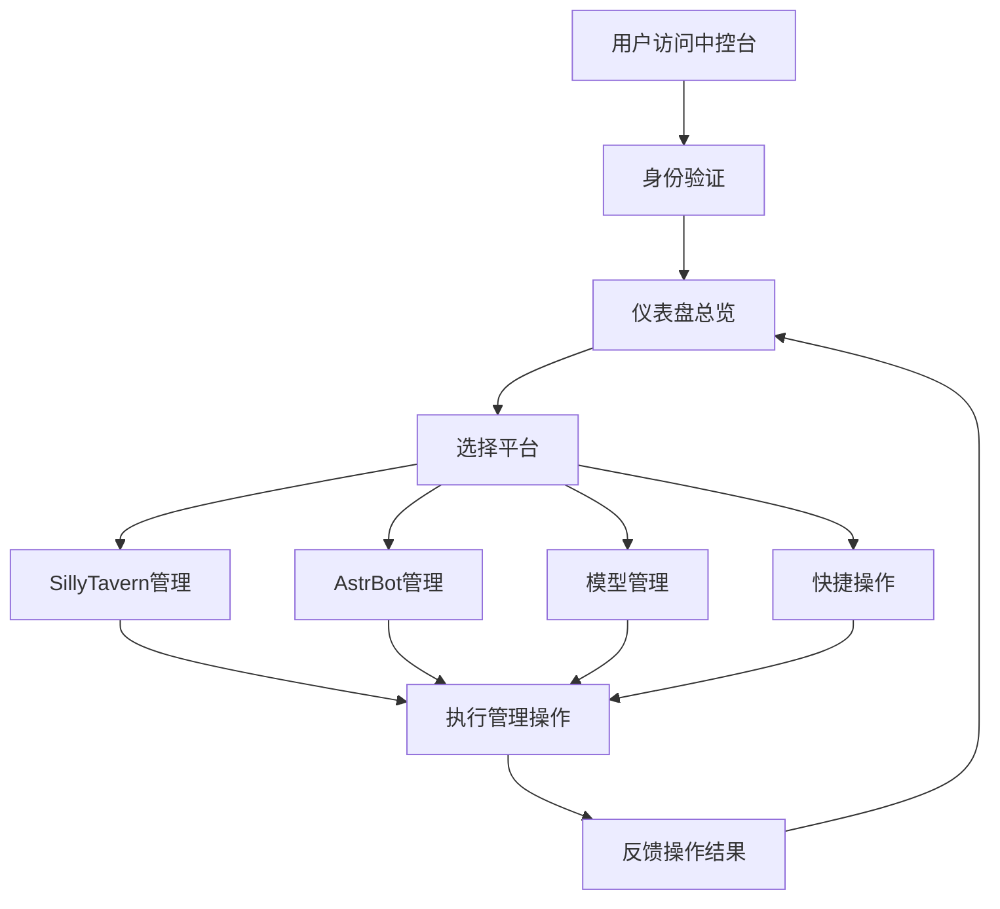

## 1. 产品概述

AI Agent 中控台是一款统一管理多个人工智能平台底层工具的 Web 应用，专为运行在 Termux（Android 本地 Linux 环境）上的 AI 服务而设计。通过调用各平台的管理 API，实现角色卡、插件、配置、服务状态等核心资源的集中管理与监控。

- **核心价值**：解决多 AI 平台管理碎片化问题，提供统一的操作入口和监控视图
- **目标用户**：AI 开发者、AI 爱好者、内容创作者，需要同时管理多个 AI 平台实例的用户
- **使用场景**：手机浏览器局域网直连访问，或通过 frp/ngrok/cloudflared 等内网穿透工具远程访问

## 2. 核心功能

### 2.1 用户角色
| 角色 | 注册方式 | 核心权限 |
|------|----------|----------|
| 管理员 | 本地配置密码 | 全部管理权限，查看所有平台状态，执行所有操作 |

### 2.2 功能模块
1. **仪表盘**：服务状态总览、系统资源监控、快捷操作入口、版本信息展示
2. **SillyTavern 管理**：角色卡管理、世界书管理、扩展插件管理、API 预设配置
3. **AstrBot 管理**：插件管理、平台适配器配置、配置文件编辑、服务状态控制
4. **模型管理**：OpenAI 兼容 API 框架（Kobold AI、LM Studio、Ollama 等）的模型列表和配置管理
5. **快捷操作**：一键重启服务、切换模型、发送测试消息、查看日志
6. **系统设置**：平台连接配置、内网穿透设置、主题切换、安全设置

### 2.3 页面详情
| 页面名称 | 模块名称 | 功能描述 |
|----------|----------|----------|
| 仪表盘 | 状态卡片组 | 展示各平台运行状态、CPU/内存使用率、运行时长 |
| 仪表盘 | 快捷操作面板 | 快速执行重启、切换模型、测试消息等常用操作 |
| 仪表盘 | 系统资源图表 | 实时展示 CPU、内存、磁盘使用率趋势图 |
| SillyTavern 管理 | 角色卡列表 | 浏览、搜索、上传、删除角色卡，查看详情 |
| SillyTavern 管理 | 世界书管理 | 世界书列表、词条编辑、导入导出 |
| SillyTavern 管理 | 扩展插件 | 已安装插件列表、启用/禁用、配置设置 |
| SillyTavern 管理 | API 预设 | API 配置管理、源切换、参数调整 |
| AstrBot 管理 | 插件中心 | 插件列表、安装卸载、配置面板 |
| AstrBot 管理 | 平台适配器 | 各消息平台连接状态和配置 |
| AstrBot 管理 | 配置编辑器 | 可视化编辑配置文件 |
| 模型管理 | 模型列表 | 已加载模型信息、模型切换、加载卸载 |
| 模型管理 | 参数配置 | 温度、top_p、max_tokens 等生成参数 |
| 快捷操作 | 操作面板 | 一键重启服务、发送测试消息、快速切换 |
| 系统设置 | 连接配置 | 各平台 API 地址、端口、密钥设置 |
| 系统设置 | 内网穿透 | frp/ngrok/cloudflared 配置和状态 |
| 系统设置 | 外观设置 | 主题切换、Neumorphism 风格调整 |

## 3. 核心流程

### 主流程
用户访问中控台 → 验证身份 → 查看仪表盘总览 → 选择目标平台 → 执行管理操作 → 查看操作结果

### 服务管理流程
查看服务状态 → 选择操作（重启/停止/查看日志）→ 确认操作 → 执行并反馈结果

## 4. 用户界面设计

### 4.1 设计风格
- **设计风格**：软立体（Neumorphism）设计
- **主色调**：柔和的蓝灰色系 (#e0e5ec 作为背景基色)
- **强调色**：柔和的蓝紫色渐变，用于突出重要操作和状态指示
- **阴影效果**：双层阴影（亮部高光 + 暗部阴影）营造凸起/凹陷的立体效果
- **按钮风格**：圆角矩形，凸起/按下两种状态，柔和的阴影过渡
- **字体**：现代无衬线字体，清晰易读，标题稍粗，正文常规
- **布局风格**：卡片式布局，网格化排列，充足留白
- **图标风格**：线性简约图标，与整体柔和风格统一

### 4.2 页面设计概览
| 页面名称 | 模块名称 | UI 元素 |
|----------|----------|----------|
| 仪表盘 | 状态卡片 | Neumorphic 卡片、状态指示灯、数据数字、趋势箭头 |
| 仪表盘 | 资源图表 | 平滑曲线图、渐变填充、Neumorphic 容器 |
| 仪表盘 | 快捷按钮 | 凸起按钮、按下效果、图标+文字 |
| 平台管理页 | 侧边导航 | 凹陷选中态、凸起未选中态、图标+标签 |
| 平台管理页 | 内容卡片 | Neumorphic 卡片、标签页、列表项 |
| 系统设置 | 表单控件 | 凹陷输入框、凸起按钮、滑动开关 |

### 4.3 响应式设计
- 桌面端优先，移动端自适应
- 侧边导航在移动端转为底部 Tab 栏
- 卡片网格响应式排列，移动端单列堆叠
- 触控优化：增大点击区域，适合手机操作
- 支持横屏/竖屏切换

### 4.4 动效设计
- 页面切换：淡入淡出 + 轻微位移
- 按钮交互：按下时阴影变化（凹陷效果）
- 状态变化：平滑过渡动画（0.3s ease）
- 数据加载：骨架屏脉冲动画
- 悬浮效果：轻微上浮 + 阴影增强
