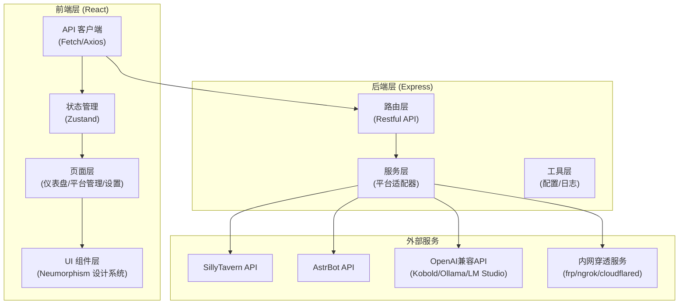
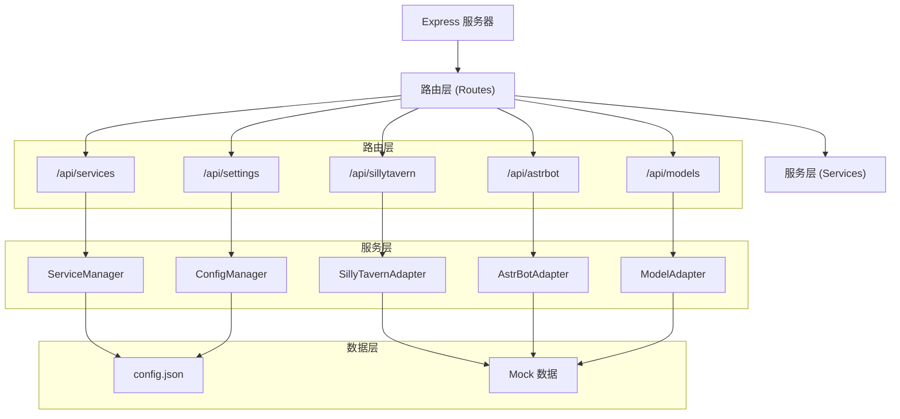

## 1. 架构设计



## 2. 技术描述

- **前端框架**：React 18 + TypeScript + Vite
- **样式方案**：Tailwind CSS 3 + 自定义 Neumorphism 工具类
- **状态管理**：Zustand
- **路由管理**：React Router DOM 6
- **图标库**：Lucide React
- **图表库**：Recharts（轻量级 React 图表库）
- **后端框架**：Express 4 + TypeScript
- **初始化工具**：vite-init (react-express-ts 模板)
- **数据存储**：本地 JSON 配置文件 + Mock 数据（开发阶段）
- **HTTP 客户端**：原生 Fetch API

## 3. 路由定义

| 路由路径 | 页面名称 | 功能说明 |
|----------|----------|----------|
| `/` | 仪表盘 | 服务状态总览、系统资源监控、快捷操作 |
| `/sillytavern` | SillyTavern 管理 | 角色卡、世界书、插件、API 预设管理 |
| `/sillytavern/characters` | 角色卡管理 | 角色卡列表、上传、删除、详情 |
| `/sillytavern/worldbooks` | 世界书管理 | 世界书列表、词条编辑 |
| `/sillytavern/plugins` | 插件管理 | 扩展插件列表、启用禁用 |
| `/sillytavern/api-presets` | API 预设 | API 配置管理 |
| `/astrbot` | AstrBot 管理 | 插件、适配器、配置管理 |
| `/astrbot/plugins` | 插件中心 | 插件列表、安装配置 |
| `/astrbot/adapters` | 平台适配器 | 消息平台连接配置 |
| `/astrbot/config` | 配置编辑器 | 配置文件可视化编辑 |
| `/models` | 模型管理 | 模型列表、切换、参数配置 |
| `/quick-actions` | 快捷操作 | 一键操作面板 |
| `/settings` | 系统设置 | 连接配置、内网穿透、外观设置 |

## 4. API 定义

### 4.1 通用类型定义

```typescript
// 服务状态
interface ServiceStatus {
  id: string;
  name: string;
  type: 'sillytavern' | 'astrbot' | 'kobold' | 'ollama' | 'lmstudio';
  status: 'running' | 'stopped' | 'error' | 'loading';
  version: string;
  port: number;
  uptime: number;
  cpuUsage: number;
  memoryUsage: number;
  url: string;
}

// 操作响应
interface ApiResponse<T = any> {
  success: boolean;
  data?: T;
  error?: string;
  message?: string;
}

// 系统资源
interface SystemResources {
  cpu: number;
  memory: number;
  memoryTotal: number;
  memoryUsed: number;
  disk: number;
  diskTotal: string;
  diskUsed: string;
}
```

### 4.2 服务管理 API

| 方法 | 路径 | 描述 | 请求体 | 响应 |
|------|------|------|--------|------|
| GET | `/api/services` | 获取所有服务状态 | - | `ServiceStatus[]` |
| GET | `/api/services/:id` | 获取单个服务详情 | - | `ServiceStatus` |
| POST | `/api/services/:id/restart` | 重启服务 | - | `ApiResponse` |
| POST | `/api/services/:id/stop` | 停止服务 | - | `ApiResponse` |
| POST | `/api/services/:id/start` | 启动服务 | - | `ApiResponse` |
| GET | `/api/services/:id/logs` | 获取服务日志 | - | `{ logs: string[] }` |

### 4.3 SillyTavern API

| 方法 | 路径 | 描述 |
|------|------|------|
| GET | `/api/sillytavern/characters` | 获取角色卡列表 |
| POST | `/api/sillytavern/characters` | 上传角色卡 |
| DELETE | `/api/sillytavern/characters/:id` | 删除角色卡 |
| GET | `/api/sillytavern/worldbooks` | 获取世界书列表 |
| GET | `/api/sillytavern/plugins` | 获取插件列表 |
| POST | `/api/sillytavern/plugins/:id/toggle` | 启用/禁用插件 |
| GET | `/api/sillytavern/api-presets` | 获取 API 预设列表 |

### 4.4 AstrBot API

| 方法 | 路径 | 描述 |
|------|------|------|
| GET | `/api/astrbot/plugins` | 获取插件列表 |
| POST | `/api/astrbot/plugins/:id/toggle` | 启用/禁用插件 |
| GET | `/api/astrbot/adapters` | 获取平台适配器列表 |
| GET | `/api/astrbot/config` | 获取配置 |
| PUT | `/api/astrbot/config` | 更新配置 |

### 4.5 模型管理 API

| 方法 | 路径 | 描述 |
|------|------|------|
| GET | `/api/models` | 获取模型列表 |
| POST | `/api/models/:id/load` | 加载模型 |
| POST | `/api/models/:id/unload` | 卸载模型 |
| GET | `/api/models/params` | 获取生成参数 |
| PUT | `/api/models/params` | 更新生成参数 |
| POST | `/api/models/test` | 发送测试消息 |

### 4.6 系统设置 API

| 方法 | 路径 | 描述 |
|------|------|------|
| GET | `/api/settings` | 获取所有设置 |
| PUT | `/api/settings` | 更新设置 |
| GET | `/api/settings/connections` | 获取连接配置 |
| PUT | `/api/settings/connections` | 更新连接配置 |
| GET | `/api/settings/tunnel` | 获取内网穿透状态 |
| POST | `/api/settings/tunnel/start` | 启动内网穿透 |
| POST | `/api/settings/tunnel/stop` | 停止内网穿透 |

## 5. 服务端架构图



## 6. 前端状态管理

### 6.1 Store 划分

```typescript
// useServiceStore - 服务状态管理
interface ServiceStore {
  services: ServiceStatus[];
  selectedService: string | null;
  loading: boolean;
  fetchServices: () => Promise<void>;
  restartService: (id: string) => Promise<void>;
  stopService: (id: string) => Promise<void>;
  startService: (id: string) => Promise<void>;
}

// useSillyTavernStore - SillyTavern 数据管理
interface SillyTavernStore {
  characters: Character[];
  worldbooks: WorldBook[];
  plugins: Plugin[];
  apiPresets: ApiPreset[];
  loading: boolean;
  fetchCharacters: () => Promise<void>;
  fetchPlugins: () => Promise<void>;
  togglePlugin: (id: string) => Promise<void>;
}

// useSettingsStore - 设置管理
interface SettingsStore {
  settings: AppSettings;
  updateSettings: (settings: Partial<AppSettings>) => Promise<void>;
}

// useUiStore - UI 状态管理
interface UiStore {
  sidebarCollapsed: boolean;
  theme: 'light' | 'dark';
  toggleSidebar: () => void;
  setTheme: (theme: 'light' | 'dark') => void;
}
```

## 7. 目录结构

```
/workspace
├── src/                          # 前端源码
│   ├── components/               # 通用组件
│   │   ├── neumorphic/          # Neumorphism 基础组件
│   │   │   ├── NeuCard.tsx
│   │   │   ├── NeuButton.tsx
│   │   │   ├── NeuInput.tsx
│   │   │   ├── NeuSwitch.tsx
│   │   │   ├── NeuProgress.tsx
│   │   │   └── NeuTabs.tsx
│   │   ├── layout/              # 布局组件
│   │   │   ├── Sidebar.tsx
│   │   │   ├── Header.tsx
│   │   │   └── MobileTabBar.tsx
│   │   └── common/              # 业务组件
│   │       ├── ServiceCard.tsx
│   │       ├── StatusIndicator.tsx
│   │       └── ResourceChart.tsx
│   ├── pages/                    # 页面组件
│   │   ├── Dashboard.tsx
│   │   ├── SillyTavern.tsx
│   │   ├── AstrBot.tsx
│   │   ├── Models.tsx
│   │   ├── QuickActions.tsx
│   │   └── Settings.tsx
│   ├── store/                    # Zustand 状态管理
│   │   ├── useServiceStore.ts
│   │   ├── useSillyTavernStore.ts
│   │   ├── useAstrBotStore.ts
│   │   ├── useModelStore.ts
│   │   └── useUiStore.ts
│   ├── utils/                    # 工具函数
│   │   ├── api.ts
│   │   ├── formatters.ts
│   │   └── constants.ts
│   ├── types/                    # 类型定义
│   │   └── index.ts
│   ├── App.tsx
│   ├── main.tsx
│   └── index.css
├── api/                          # 后端源码
│   ├── routes/                   # 路由
│   │   ├── services.ts
│   │   ├── sillytavern.ts
│   │   ├── astrbot.ts
│   │   ├── models.ts
│   │   └── settings.ts
│   ├── services/                 # 业务逻辑
│   │   ├── ServiceManager.ts
│   │   ├── SillyTavernAdapter.ts
│   │   ├── AstrBotAdapter.ts
│   │   ├── ModelAdapter.ts
│   │   └── ConfigManager.ts
│   ├── data/                     # Mock 数据
│   │   └── mockData.ts
│   ├── types/                    # 类型定义
│   │   └── index.ts
│   └── index.ts
├── shared/                       # 前后端共享类型
│   └── types.ts
├── public/                       # 静态资源
├── package.json
├── tsconfig.json
├── vite.config.ts
├── tailwind.config.js
└── postcss.config.js
```
